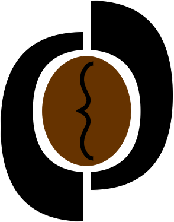
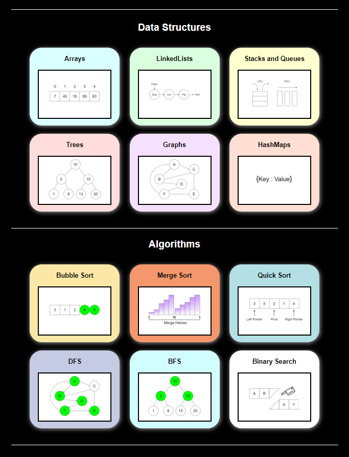
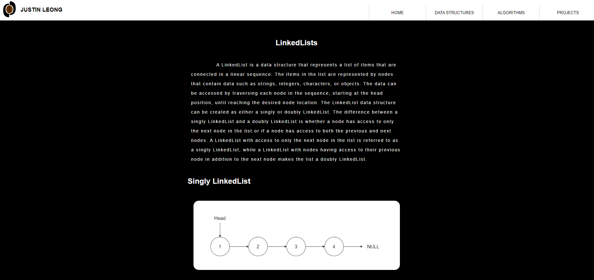
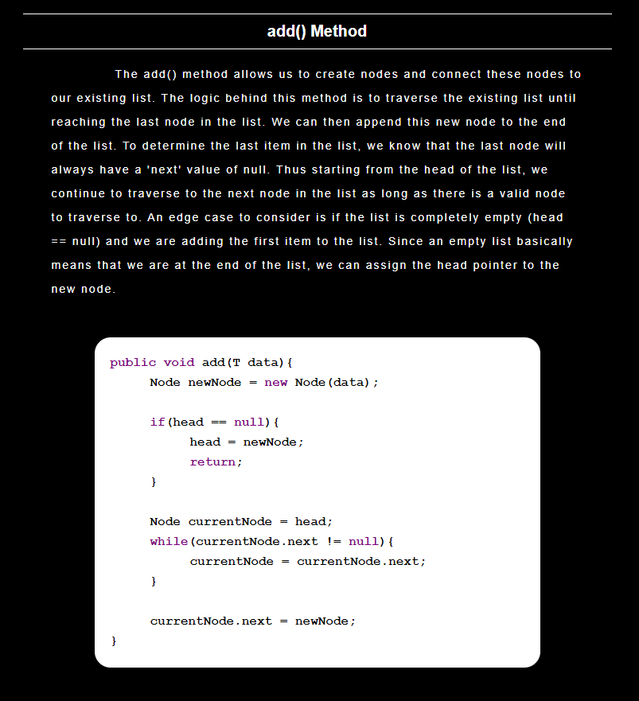
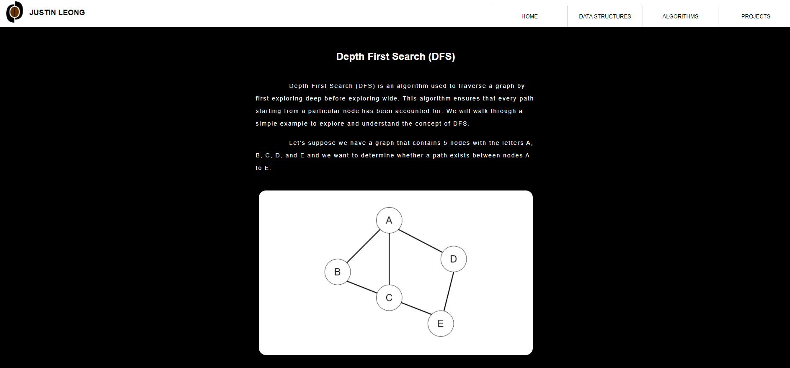
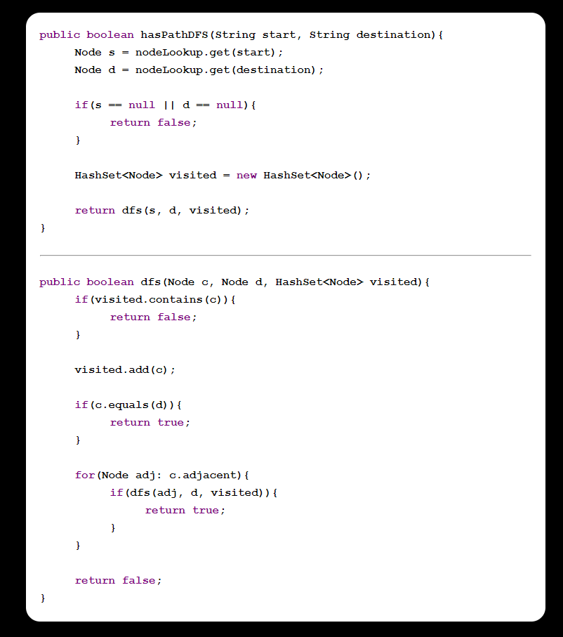
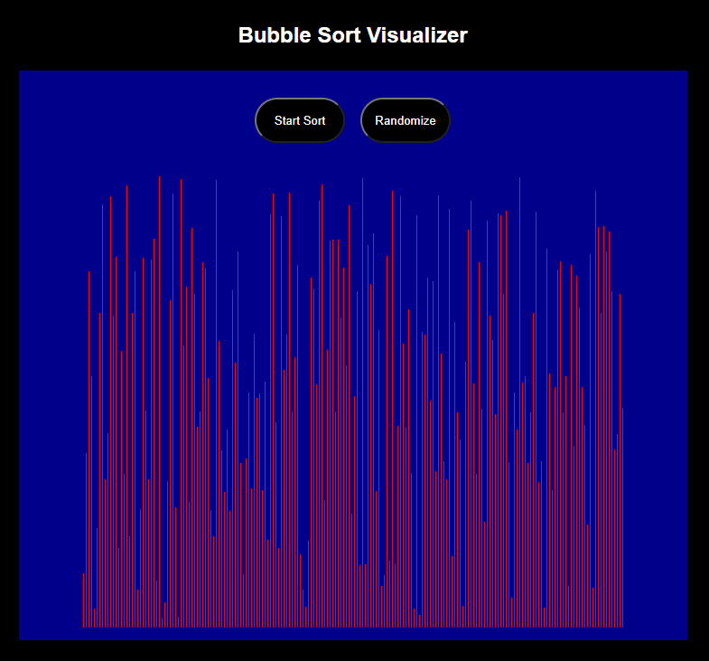
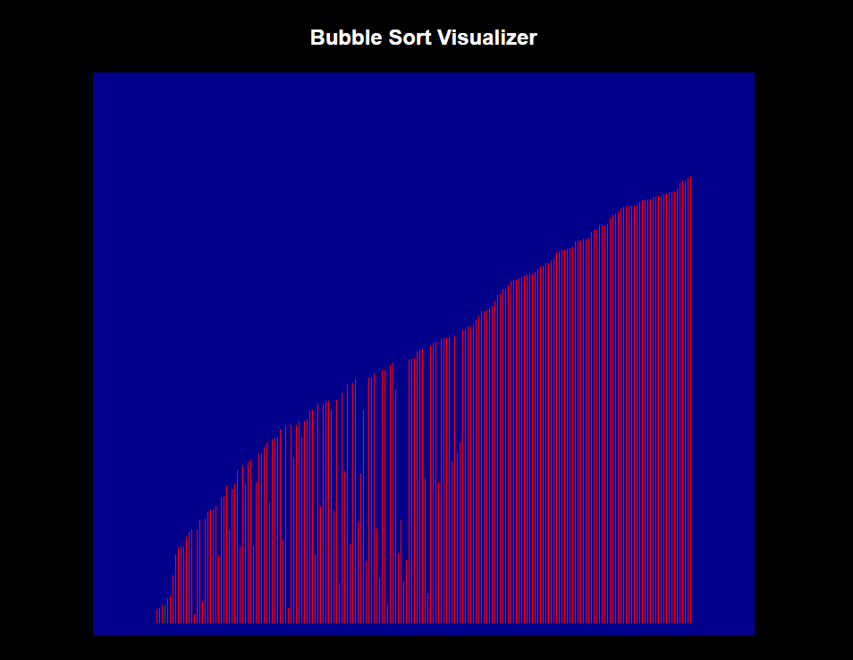
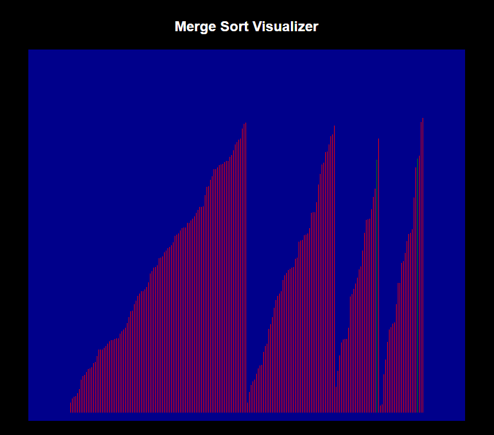

# CoffeeCodeCoffee
www.coffeecodecoffee.com

CoffeeCodeCoffee is a personal project I started as a way to practice and learn about frontend web development. This website was created using purely HTML, CSS, and JavaScript to improve my skills using these three core web development tools. In this website, I share my knowledge of key software engineering concepts related to data structures and algorithms. In each topic, I explain and reconstruct the concept from scratch while showcasing snippets of code in Java. My goal is to be able to share my knowledge with those who have a passion for coding and to continue to improve my own skills along the way!

Each data structure and algorithm has its own page where I describe the high level functionality then implement it step by step in code. Below is a small sample of some of the content in the linked list data structure and depth first search algorithm pages.

In addition to describing and implementing data structures and algorithms, I have included a project section that includes a sorting visualizer application built using Javascript. This is an interactive program that allows anyone who visits the site to randomize the heights of bars to be sorted using the bubble or merge sort algorithms. This allows people to better understand the idea behind the algorithms that they learn in a visual manner.

